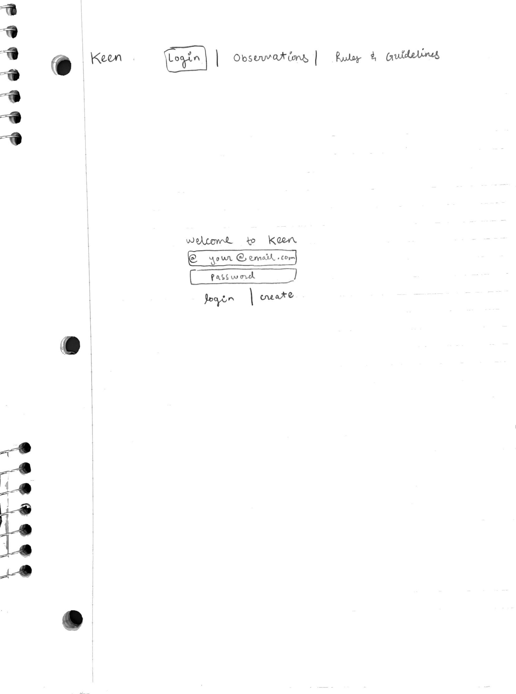
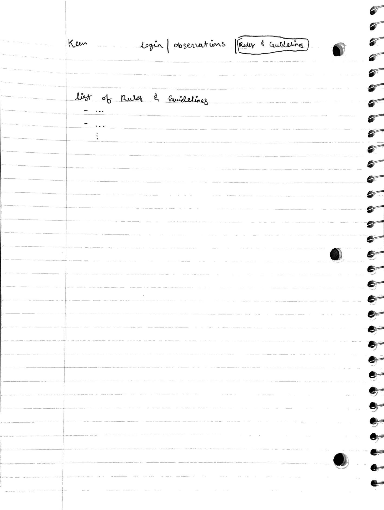

# startup

# JavaScript

Quick Explanation:
login.js saves username locally and prompts user to "observations" page
observations.js saves username and observations entered in JSON objects which are displayed on screen

Longer Explanation:
I added a login.js file that is very similar to the one implemented in Simon. This login.js handles the user name for now.
Enter a user name and then click "submit" the javascript will save your user name and direct it to the "observations" page.
The "observations" page is where the observations.js file comes in to play. You can enter your daily observations into the 
text entry box on this page. Once you click "save" your observation will be saved to a JSON object and will be presented to 
you on the screen. There is another JSON object that saves user names. Eventually when I implement Web Sockets, there will be
JSON objects containing other user's user names that will inform you who else is posting. As of right now, it only presents 
the user's user name with a little message stating "(username) made an observation: (the observation)"